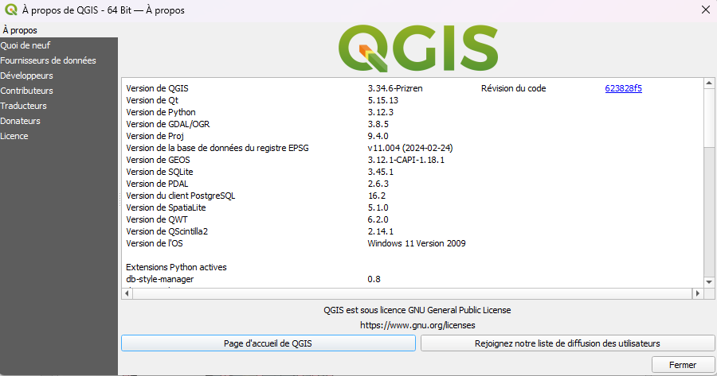
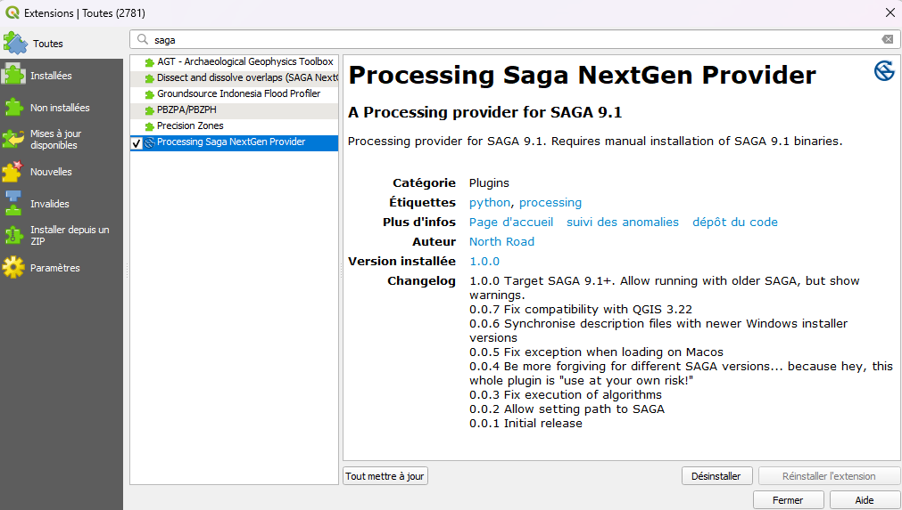
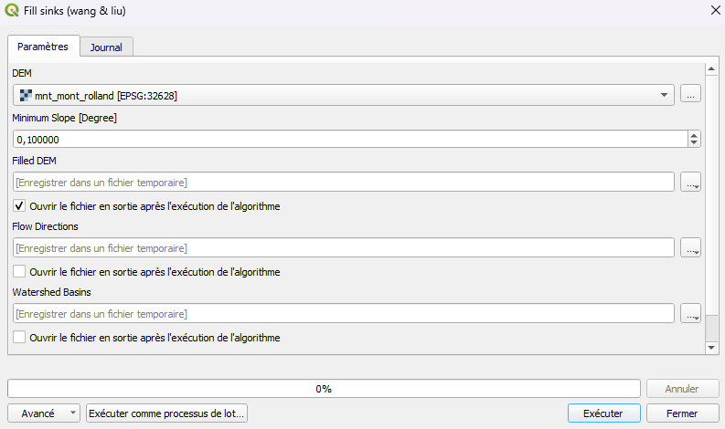
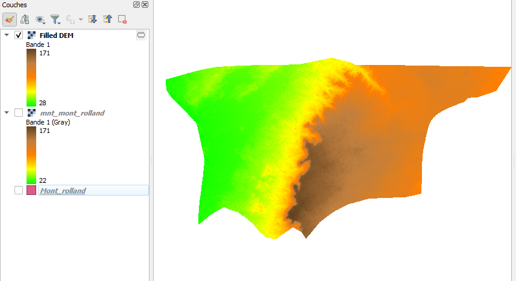
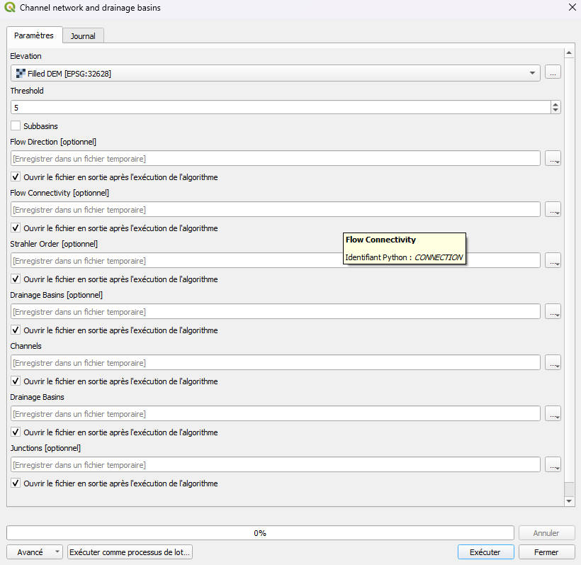
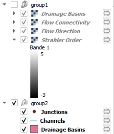

---
date:
  created: 2026-06-07
authors:
  - darc
categories:
  - Hydrologie
  - Tutoriels
tags:
  - QGIS
  - SAGA GIS
  - Hydrologie
  - Bassin versant
  - MNT
  - Sénégal
description: "Délimiter un bassin versant avec SAGA GIS depuis QGIS : installation, configuration et application sur la commune de Mont-Rolland (région de Thiès, Sénégal)."
---

# Délimitation d'un bassin versant avec SAGA GIS depuis QGIS

{ .img-center }

La délimitation d'un bassin versant est l'une des opérations de base en hydrologie spatiale. SAGA GIS, intégré dans QGIS via le plugin **SAGA NextGen Provider**, offre des outils puissants pour réaliser cette analyse à partir d'un Modèle Numérique de Terrain (MNT). Cet article détaille le workflow complet appliqué à la commune de Mont-Rolland, dans la région de Thiès.

<!-- more -->
---
## Concepts de base

**Bassin versant** : zone géographique dont toutes les eaux de ruissellement convergent vers un même exutoire. Sa délimitation repose sur la topographie du terrain.
*Sources : [FAO — Watershed Management](https://www.fao.org/watershed-management) · Musy, A. & Higy, C. (2004). Hydrologie : une science de la nature. PPUR.*

**MNT (Modèle Numérique de Terrain)** : représentation raster de l'altitude du sol. C'est la donnée d'entrée indispensable pour toute analyse hydrologique.
*Sources : [USGS — Digital Elevation Models](https://www.usgs.gov/faqs/what-digital-elevation-model-dem) · Maune, D.F. (2007). Digital Elevation Model Technologies and Applications. ASPRS.*

**Sinks (dépressions)** : anomalies topographiques présentes dans les MNT bruts, souvent dues aux artefacts radar. Ce sont des cellules sans direction d'écoulement valide qui interrompent le calcul du réseau hydrographique. Leur correction est une étape indispensable avant toute analyse.
*Sources : Wang, L. & Liu, H. (2006). An efficient method for identifying and filling surface depressions in digital elevation data. International Journal of Geographical Information Science, 20(2), 193–213. · [SAGA GIS Documentation](https://saga-gis.sourceforge.io/saga_tool_doc/2.2.1/ta_preprocessor_4.html)*

**Direction d'écoulement** : pour chaque cellule du raster, direction vers laquelle l'eau s'écoule parmi les 8 cellules voisines.
*Sources : O'Callaghan, J.F. & Mark, D.M. (1984). The extraction of drainage networks from digital elevation data. Computer Vision, Graphics, and Image Processing, 28(3), 323–344. · [ESRI — Flow Direction](https://pro.arcgis.com/en/pro-app/latest/tool-reference/spatial-analyst/flow-direction.html)*

**Ordre de Strahler** : système de classification des cours d'eau par importance. Les sources ont l'ordre 1. Quand deux cours d'eau de même ordre se rejoignent, l'ordre augmente d'un. Plus l'ordre est élevé, plus le cours d'eau est important.
*Sources : Strahler, A.N. (1957). Quantitative analysis of watershed geomorphology. Transactions of the American Geophysical Union, 38(6), 913–920. · [USGS — Stream Order](https://www.usgs.gov/media/images/streamorder)*

**Threshold (seuil d'accumulation)** : nombre minimum de cellules qui doivent contribuer à un point pour qu'il soit considéré comme faisant partie du réseau hydrographique. Un seuil bas produit un réseau dense, un seuil élevé produit un réseau simplifié.
*Sources : Tarboton, D.G., Bras, R.L. & Rodriguez-Iturbe, I. (1991). On the extraction of channel networks from digital elevation data. Hydrological Processes, 5(1), 81–100. · [SAGA GIS Documentation](https://saga-gis.sourceforge.io/saga_tool_doc/7.7.0/ta_compound_0.html)*

## Installation de QGIS LTR et du plugin SAGA NextGen Provider

### Pourquoi utiliser la version LTR ?

La version **LTR (Long Term Release)** de QGIS est la version stable recommandée pour les projets professionnels. Elle reçoit des corrections de bugs pendant au moins un an, contrairement aux versions régulières qui évoluent rapidement. Pour des analyses hydrologiques reproductibles, la stabilité est prioritaire.

### Installer QGIS LTR

1. Se rendre sur [**qgis.org/download**](https://qgis.org/download/)
2. Télécharger une version **QGIS LTR** - J'utilise ici la version 3.34.6-Prizen

{ .img-center }
3. Lancer l'installateur et suivre les étapes par défaut.

### Activer le plugin SAGA NextGen Provider

1. Dans QGIS : **Extensions → Installer/Gérer les extensions**
2. Chercher **"Processing Saga NextGen Provider"**
3. Installer et activer le plugin

{ .img-center }
4. Redémarrer QGIS

Une fois activé, les outils SAGA sont accessibles depuis **Traitement → Boîte à outils → SAGA NextGen**.

!!! warning "SAGA non détecté ?"
    Si les outils SAGA n'apparaissent pas après activation du plugin, installer SAGA GIS séparément depuis **saga-gis.org** et configurer le chemin dans **Préférences → Options → Traitement → Fournisseurs de traitements → SAGA**.

## Données utilisées

- **Zone d'étude** : Commune de Mont-Rolland, région de Thiès, Sénégal
- **MNT** : Alaska Satellite Facility ([ASF](https://search.asf.alaska.edu/#/)) — résolution 12,5 m
- **Projection** : EPSG:32628 (UTM zone 28N)
  
Cliquer [ici](https://github.com/darcman0/My_data/releases/download/dataset_saga_gis_article/saga_bv_dataset_article.zip) télécharger les données utilisées !

## Workflow

Le traitement se déroule en deux phases : un prétraitement du MNT pour corriger les dépressions artificielles, puis l'extraction du réseau hydrographique et des bassins versants.

### Phase 1 - Prétraitement : Fill Sinks Wang & Liu

Avant d'analyser les écoulements, il faut corriger le MNT brut. Les sinks sont des dépressions artificielles dans lesquelles les flux d'eau virtuels se retrouvent piégés, interrompant le calcul du réseau hydrographique.

**Outil :** `SAGA NextGen → Terrain Analysis → Preprocessing → Fill Sinks (Wang & Liu)`

**Paramétrage :**

| Paramètre | Valeur |
|---|---|
| **DEM** | MNT brut découpé sur la commune [EPSG:32628] |
| **Filled DEM** | Définir un chemin de sauvegarde (ex : `MNT_filled.tif`) |
| **Minimum Slope** | 0.01 (valeur par défaut) |

!!! info "Pourquoi Fill Sinks Wang & Liu ?"
    L'algorithme Fill Sinks Wang & Liu (2006) est l'un des plus robustes pour le comblement des dépressions. Il est particulièrement adapté aux MNT radar comme ceux de l'ASF, qui contiennent fréquemment des artefacts de surface.

{ .img-center }
*MNT après correction des dépressions,le MNT corrigé est la donnée d'entrée pour la phase suivante.* On constate une certaine différence entre le modèle numérique de base et celui corrigé. 
{ .img-center }

### Phase 2 - Extraction du réseau et des bassins versants

À partir du MNT corrigé, on extrait en une seule exécution le réseau hydrographique et les bassins versants.

**Outil :** `SAGA NextGen → Terrain Analysis → Hydrology → Channel network and drainage basins`

**Paramétrage :**

| Paramètre | Valeur | Explication |
|---|---|---|
| **Elevation** | MNT filled [EPSG:32628] | Le MNT corrigé de la phase précédente |
| **Threshold** | 5 | Seuil d'accumulation adapté à une petite commune |
| **Subbasins** | décoché | Génère les sous-bassins en plus des bassins principaux |

{ .img-center }
*Fenêtre de paramétrage de l'outil Channel network and drainage basins.*

!!! info "Choix du threshold à 5"
    Avec un MNT à 12,5 m de résolution, chaque cellule représente 156 m². Un seuil de 5 signifie qu'une surface d'environ 780 m² suffit pour initier un chenal. Ce choix est adapté à Mont-Rolland dont le relief modéré génère un réseau peu hiérarchisé. Pour un grand bassin versant, on augmenterait ce seuil.

### Résultats de l'extraction

L'outil génère simultanément les couches suivantes :

**Flow Direction** — direction d'écoulement de chaque cellule vers l'une de ses 8 voisines.

**Strahler Order** — classification hiérarchique du réseau hydrographique.

**Channels** — réseau hydrographique extrait à partir du seuil défini.

**Drainage Basins** — délimitation automatique des bassins versants.

## Résultats

### Résultats de l'extraction

Après exécution, QGIS charge automatiquement les résultats qu'on a organisés ici en deux groupes :

{ .img-center }
*Résultats générés par Channel network and drainage basins dans le panneau des couches.*

**Groupe 1 — Rasters**

- **Drainage Basins** - raster identifiant chaque bassin versant par une valeur unique
- **Flow Connectivity** - nombre de cellules qui contribuent à chaque point du réseau
- **Flow Direction** - direction d'écoulement de chaque cellule vers l'une de ses 8 voisines
- **Strahler Order** - ordre hiérarchique du réseau (valeurs de -3 à 5 sur Mont-Rolland)

**Groupe 2 — Vecteurs**

- **Junctions** - points de confluence entre cours d'eau
- **Channels** - réseau hydrographique vectoriel (lignes)
- **Drainage Basins** - bassins versants en polygones, directement exploitables en SIG
  
## Pour aller plus loin

- Tester différentes valeurs de threshold (3, 5, 10) et comparer la densité du réseau obtenu
- Croiser les bassins versants délimités avec des données d'occupation du sol pour une analyse de vulnérabilité
  
Une démonstration complète de ce workflow est disponible sur YouTube :

<iframe width="100%" style="aspect-ratio:16/9;border-radius:8px;margin:1rem 0" 
src="https://www.youtube.com/embed/6K3KkHtHs5Q" 
title="Délimitation bassin versant SAGA GIS QGIS" 
frameborder="0" 
allow="accelerometer; autoplay; clipboard-write; encrypted-media; gyroscope; picture-in-picture" 
allowfullscreen>
</iframe> 

---
*Analyse réalisée avec QGIS LTR 3.34.6 couplé à SAGA GIS sur la commune de Mont-Rolland, région de Thiès, Sénégal.*