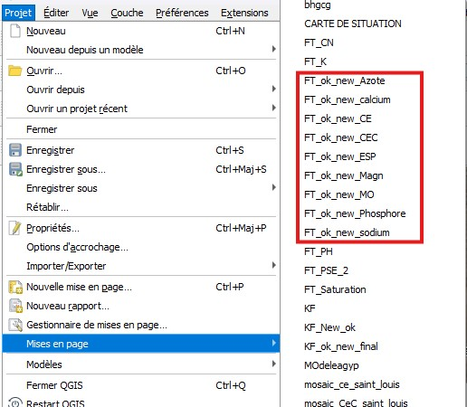
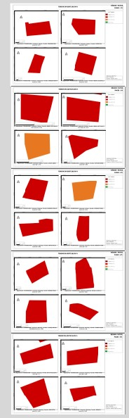

---
date:
  created: 2026-08-16
authors:
  - darc
categories:
  - SIG
  - Python

description: Comment exporter uniquement une liste ciblée de mises en page QGIS en haute précision (300 DPI, sans simplification de géométrie) avec un script PyQGIS, à partir d'un cas réel sur 78 parcelles et 11 paramètres de fertilité des sols.
---

# Exporter sélectivement ses mises en page QGIS avec PyQGIS (300 DPI, sans perte)

Sur un projet de cartographie pédologique portant sur 78 parcelles réparties dans trois régions du Sénégal (Fatick, Kaolack, Saint-Louis) et 11 paramètres de fertilité des sols (azote, phosphore, potassium, calcium, magnésium, sodium, soufre, matière organique, CEC, pH, CE), le projet QGIS contenait les mises en page des trois régions mélangées. Je n'avais besoin d'exporter que celles de Fatick, ce qui rendait le Gestionnaire de mises en page peu pratique. Quand le projet contient des dizaines de mises en page et qu'on ne veut en exporter qu'une poignée en une seule fois, avec des réglages de précision stricts, il faut passer par PyQGIS.

Voici le protocole que j'ai mis en place.

<!-- more -->

---

## Le besoin

Le projet contenait les mises en page des trois régions dans le même fichier QGIS. Pour la région de Fatick (préfixe `FT`), il s'agissait des fiches par élément suivantes :

- `FT_ok_new_K`
- `FT_ok_new_Magn`
- `FT_ok_new_MO`
- `FT_ok_new_Phosphore`
- `FT_ok_new_sodium`
- `FT_ok_new_soufre`
- `FT_ok_new_calcium`
- `FT_ok_new_Azote`

Les mises en page :
{ .img-center }

l'architecture d'une de ces mises en page:
{ .img-center }


Objectif : exporter uniquement les 8 mises en page de Fatick, en excluant celles de Kaolack et Saint-Louis présentes dans le même projet, avec trois contraintes non négociables pour des données de précision agronomique :

1. **300 DPI**, pour garder les étiquettes et les légendes lisibles
2. **Aucune simplification de géométrie**, pour conserver chaque sommet des limites de parcelles
3. **Export sans perte**, pour éviter les artefacts de compression sur les fonds raster

## Pourquoi pas le Gestionnaire de mises en page

La méthode native (`Projet > Gestionnaire de mises en page`, sélection multiple avec Ctrl/Shift, puis export groupé) fonctionne bien pour un export ponctuel de l'ensemble des mises en page d'un projet. Mais dès qu'on doit filtrer une liste précise dans un projet qui en contient beaucoup, la sélection manuelle devient une source d'erreur, surtout si les noms se ressemblent (`sodium` vs `Sodium`).

Le script Python règle ce problème une fois pour toutes.

## Le script

```python
import os
from qgis.core import QgsProject, QgsLayoutExporter

# Dossier de destination
output_folder = "D:/Projet_Fertilite/Exports_FT/"
if not os.path.exists(output_folder):
    os.makedirs(output_folder)

# Liste exacte des mises en page à exporter
target_layouts = [
    "FT_ok_new_K", "FT_ok_new_Magn", "FT_ok_new_MO",
    "FT_ok_new_Phosphore", "FT_ok_new_sodium", "FT_ok_new_soufre",
    "FT_ok_new_calcium", "FT_ok_new_Azote"
]

project = QgsProject.instance()
manager = project.layoutManager()

for layout_name in target_layouts:
    layout = manager.layoutByName(layout_name)

    if layout:
        exporter = QgsLayoutExporter(layout)
        file_path = os.path.join(output_folder, f"{layout_name}.pdf")

        settings = QgsLayoutExporter.PdfExportSettings()
        settings.dpi = 300
        settings.simplifyGeometries = False
        settings.rasterizeWholeLayout = False

        result = exporter.exportToPdf(file_path, settings)

        if result == QgsLayoutExporter.Success:
            print(f"Export réussi : {layout_name}")
        else:
            print(f"Erreur lors de l'export de : {layout_name}")
    else:
        print(f"Mise en page introuvable : {layout_name}")
```

## Ce que font les trois réglages clés

| Paramètre | Valeur | Effet |
|---|---|---|
| `dpi` | 300 | Netteté suffisante pour l'impression A3/A4 et la lecture des valeurs chiffrées |
| `simplifyGeometries` | `False` | Conserve chaque sommet des polygones, essentiel sur des limites de parcelles |
| `rasterizeWholeLayout` | `False` | Garde les couches vectorielles en vecteur plutôt que de tout aplatir en image |

## Utiliser le script dans QGIS

1. Ouvrir la console Python (`Ctrl+Alt+P` ou `Extensions > Console Python`)
2. Cliquer sur l'icône d'éditeur (feuille avec crayon) pour ouvrir une zone de script
3. Coller le code et modifier la ligne `output_folder` avec le chemin voulu
4. Lancer avec la flèche verte

Les messages `Export réussi` s'affichent dans la console au fur et à mesure.

!!! warning "Points de vigilance"
    - Les noms de mises en page sont sensibles à la casse : `sodium` et `Sodium` ne sont pas la même mise en page
    - Fermer les mises en page ouvertes en édition avant de lancer le script
    - Vérifier que le dossier de sortie n'est pas en lecture seule

## Validation

Après export, j'ouvre un des PDF et je zoome à 400-800% sur une limite de parcelle. Si le trait reste net, sans crénelage ni segments rectilignes inattendus, le paramètre `simplifyGeometries = False` a bien été appliqué.

À noter : désactiver la simplification sur des couches denses fait grossir les fichiers PDF de façon significative. C'est le compromis à accepter pour garder l'intégrité des données.

---

*Workflow développé dans le cadre d'un projet de cartographie pédologique, 78 parcelles réparties entre Fatick, Kaolack et Saint-Louis, 11 paramètres de fertilité des sols.*